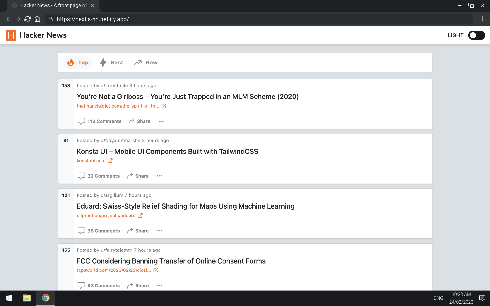

# Deploying From Source

## Modern web-app

For this exercise, we will be deploying a semi-static web-app directly from our source-control in GitHub to various providers.
The application we will be deploying is an alternative UI for [Hacker News](https://news.ycombinator.com/).

In this demo, we will be deploying to the following providers. Based on how fast you are, you can pick as many as you want:

- [Vercel](https://vercel.com)
- [Netlify](https://netlify.com)
- [AWS Amplify](https://aws.amazon.com/amplify/)

### Deploying

1. Fork [this repo](https://github.com/Addono/nextjs-hackernews) from GitHub into your personal organisation
2. Setup deployment from GitHub

   - **Vercel**

     1. Login or register at https://vercel.com
     2. “Add new …” > “Project” > “Import from Git” > Select forked repo from GitHub

   - **Netlify**

     1. Login or register at https://app.netlify.com/
     2. “Add new site” > “Import an existing project” > “GitHub” > Select forked repo

   - **AWS Amplify**

     1. Login to AWS Console, details can be found at https://intra.eficode.com/display/ITSEC/Accessing+Eficode%27s+test+AWS+accounts
     2. Navigate to AWS Amplify page (easiest to use the search bar at the top)
     3. “Get Started” > “Host a web-app” > “GitHub” > Select forked repo > Click “Next” on all defaults > “Safe and deploy”
     4. (After you’re done) Delete the Amplify App

3. _(Optional)_ Configure a custom domain

   - **Vercel**

     1. Open the settings of your site, it will be under `https://vercel.com/{USERNAME}/nextjs-hackernews/settings`.
     2. In the left-hand panel select "Domains", then add a domain through the form. You can pick either one you control yourself, or pick a `somethingyouwant.vercel.app`. For your own domains, you will have to follow the instructions to configure correct DNS entries.

   - **Netlify**

     1. Go to "Site settings" > "Domain management" > "Domains"
     2. Either change the `somethingyouwant.netlify.app` domain which is already configured, or add a new custom domain you manage yourself.

   - **AWS Amplify**

     1. Go to "App settings" > "Domain management" and click "Add domain"
     2. Select a domain or subdomain you want
     3. Follow the instructions on setting up the DNS configuration, if you're using a domain which is already in Route53 then AWS will be able to do this for you.

### Evaluation

Let's see what we now have:

- Navigate around the website to see what we have.

  - Open up the network console to see what's happening under the hood
  - Go to `/api/hello` as an example of how besides just a static-site deployment we also have deployed server-side logic

- What would the development flow look like?

  The default behaviour will differ a bit between vendors:

  - Vercel will deploy every branch and commit,
  - Netlify every PR, and
  - AWS Amplify only on our `main` branch. However with additional configuration it can also deploy every branch.

  Let's see what we got out of the box and make some change to the application:

  1. Let's make some small change - e.g. change the title in [`./components/SiteHeader.js:14`](https://github.com/Addono/nextjs-hackernews/blob/9fd6baf1b6c4dfea2186b0b21d7eab1868c8b809/components/SiteHeader.js#L14) and commit that in a new branch.
  2. Create a pull-request against the `main`-branch of **your own** fork.
  3. Observe the GitHub integration doing it's work in the comments of your PR.
  4. Merge in your PR and see how long it takes for your changes to propegate.

- Performance comparison
  - Let's look into some global latency characteristics of our website, the following tool will measure the request duration from various points across the globe: https://tools.bunny.net/http-test. Try to see if you can pick up on:
    - Cache misses / Cold starts
    - Deployment region: Can you see from the request duration one location all requests go to.
  - For reference, compare your deployments to:
    - https://news.ycombinator.com
    - https://hacker-news.firebaseio.com

<!--
    - But, does this actually matter? Most browser's come with build-in website performance checking tools. In Chrome that would be Lighthouse.
      - To open Lighthouse in Chrome: "Options" > "More Tools" > "Developer Tools" > "Lighthouse"
      - Run a test by clicking "Analyze page load"
-->

<!--

Deploy Realworld Redwood app

1. Fork repo from GitHub

-->
