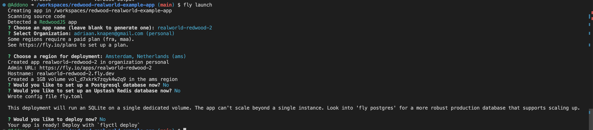

## Deploy Realworld Redwood app

1. Fork [this repo](https://github.com/addono/redwood-realworld-example-app) into your personal GitHub account
2. Spin up a new GitHub Codespaces instance (click on "Code" and then the "Codespaces" tab). _You can also follow the following steps locally by checking out the repo._
3. Install Fly.io
    1. Install the Fly CLI tool ([docs](https://fly.io/docs/hands-on/install-flyctl/#linux)):
        ```bash
        curl -L https://fly.io/install.sh | sh
        ```
    2. Add the Fly-executable to your path:
        ```bash
        export FLYCTL_INSTALL="/home/codespace/.fly"
        export PATH="$FLYCTL_INSTALL/bin:$PATH"
        ```
4. Authenticate to Fly.io
   1. Run `fly auth login`
   2. Open the link shown in your shell
   3. If you don't yet have an account, create one and add a credit card. (We will be staying within their free-credits with this demo.) 
5. Let's create an app by running `fly launch`
    - Pick a name you like
    - We won't be adding Postgres or Redis to this app, so feel free to say "No" when prompted
    - Do not yet deploy the app
    
    Your prompots should look something like this:
    

6. Fly automatically picked up that we're trying to deploy a Redwood app, so it helped us by creating some files from their template. You can use Git to see what has changed.
    - `fly.toml` configuring how this application should be deployed and how the networking should be configured.
    - `.fly/` containing some scripts to start the application and migrate the database.
    - `Dockerfile` and `.dockerignore` to containerize the application (Fly also supports [BuildPacks](https://buildpacks.io/)).

7. One additional think which changed is that Yarn upgraded itself automatically -_- , let's undo that for now:
    ```bash
    git clean .yarn -df && git checkout .yarn .yarnrc.yml package.json
    ```

8. We're ready to deploy our application
    ```bash
    fly deploy
    ```

9. Let's open up the application we just deployed. Try signing up, is everything working?

10. Something is wrong, let's check out the logs. 
    - Either:
      - Go the the Fly.io portal, there you will find the logs under "Monitoring" _(Hint: A link was printed at the end of the deploy-log.)_
      - Use the CLI and run `fly logs` to attach to the logs
    - Then, try that signup again.

11. From the logs we see that we're missing some `SESSION_SECRET` environment variable. Let's set that:
    ```bash
    fly secrets set SESSION_SECRET=very-secret-secret  # You really want to use a truly random string in proper production environments
    ```

12. Wait for the deployment to complete, then try again. This time your login should work.

13. If you now use the app, you will notice that the Post-create form is broken. That sounds like something we can fix! It's missing the required `slug`-field.
    1.  Open up `web/src/components/PostEditor/PostEditor.tsx`
    2.  Under the "title"-field (line 96), insert another form field for the slug:
    ```ts
    <fieldset className="form-group">
        <TextField
            name="slug"
            validation={{ required: true, pattern: /[A-Za-z\-]+/ }}
            errorClassName="form-control form-control-lg rw-input-error"
            className="form-control form-control-lg"
            placeholder="article-slug"
            defaultValue={post?.slug}
            />
        <FieldError name="slug" className="rw-field-error" />
    </fieldset>
    ```

14. Redeploy with `fly deploy`, profit!

